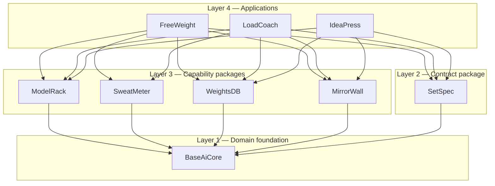
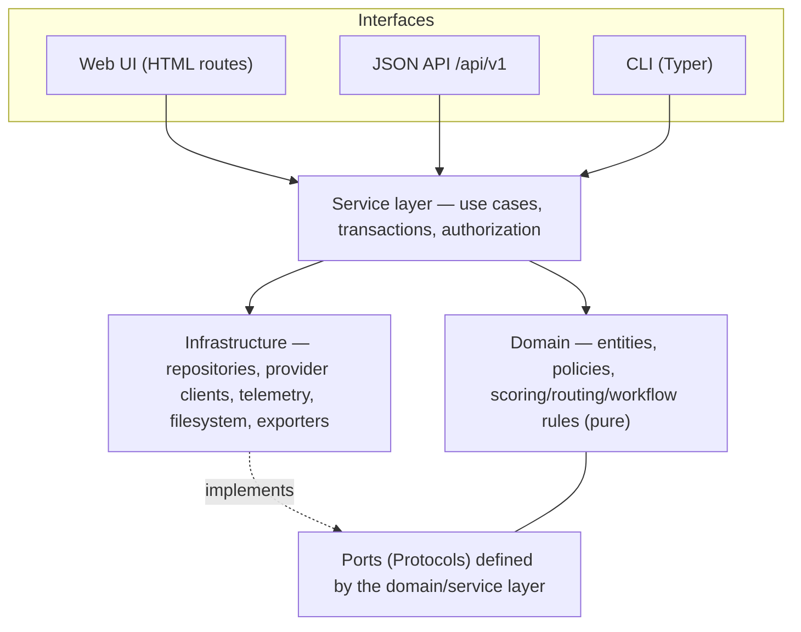
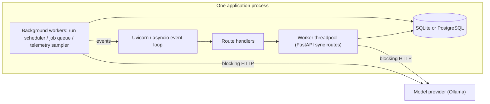
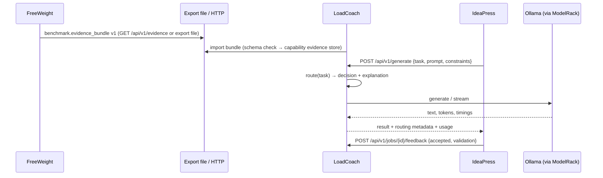
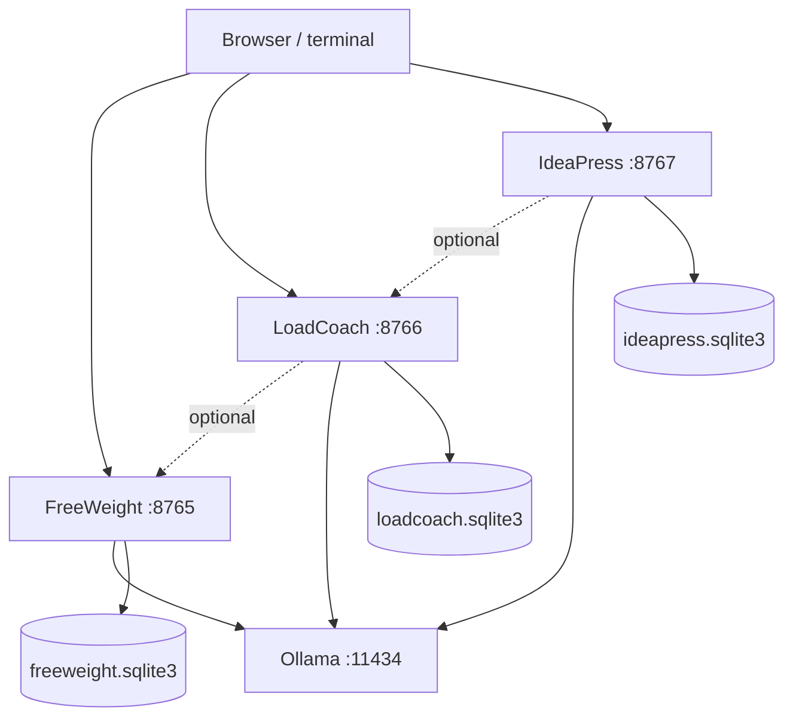
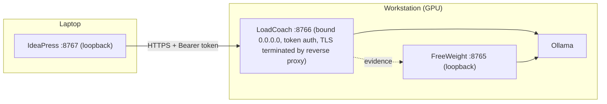
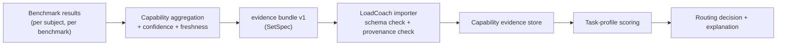
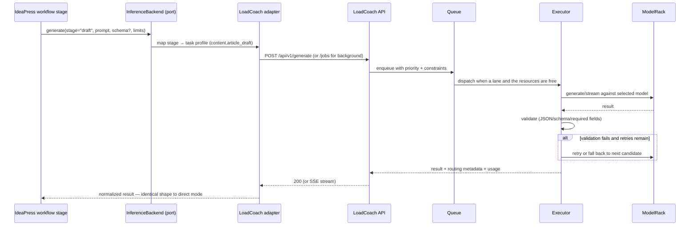
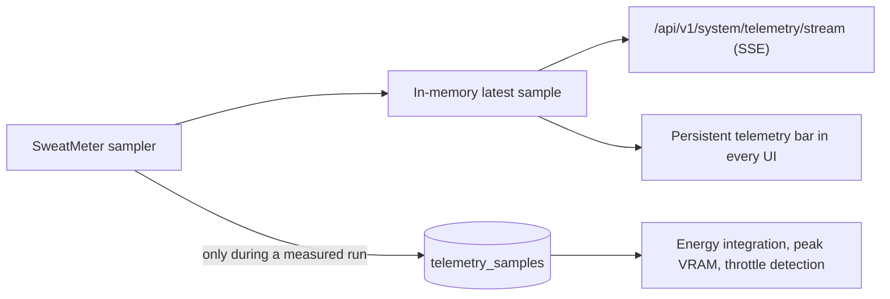

# Master Architecture

**Status:** Authoritative. Frozen 2026-08-21; corrected 2026-08-21 by the
[final architecture audit](../reviews/final_architecture_audit.md) (ADR-0022 – ADR-0029).
**Audience:** every implementation agent working on any part of the suite.

This document defines the suite's structure, boundaries, dependency direction, runtime model,
communication contracts, deployment shapes and data flows. Where a component specification adds
detail it must not contradict this document; if it does, this document wins and the contradiction
is a defect.

---

## 1. Canonical vocabulary

Fixed for the life of the suite. Use these exact spellings everywhere — code, docs, UI, logs, CLI.

### 1.1 Component names and identifiers

| Component | Kind | Import name | Distribution name | CLI command | Default port | Env prefix |
|---|---|---|---|---|---:|---|
| FreeWeight | Application | `freeweight` | `freeweight` | `freeweight` | 8765 | `FREEWEIGHT_` |
| LoadCoach | Application | `loadcoach` | `loadcoach` | `loadcoach` | 8766 | `LOADCOACH_` |
| IdeaPress | Application | `ideapress` | `ideapress` | `ideapress` | 8767 | `IDEAPRESS_` |
| BaseAiCore | Package | `baseaicore` | `baseaicore` | — | — | — |
| SetSpec | Package | `setspec` | `setspec` | — | — | — |
| ModelRack | Package | `modelrack` | `modelrack` | — | — | — |
| SweatMeter | Package | `sweatmeter` | `sweatmeter` | — | — | — |
| WeightsDB | Package | `weightsdb` | `weightsdb` | — | — | — |
| MirrorWall | Package | `mirrorwall` | `mirrorwall` | — | — | — |

Product names are CamelCase in prose and UI. Import and distribution names are lowercase and
identical to each other. Distribution-name availability on PyPI is verified before first publish;
the documented fallback is `aisuite-<name>` (see [Packaging Standards](../standards/packaging-and-release-standards.md)).

### 1.2 Filesystem conventions

```text
~/.config/<app>/config.toml        # configuration      (respects XDG_CONFIG_HOME)
~/.local/share/<app>/              # data root          (respects XDG_DATA_HOME)
  ├── <app>.sqlite3                # application database
  ├── artifacts/                   # large blobs referenced by rows
  ├── exports/                     # generated export files
  └── backups/                     # pre-migration and on-demand backups
~/.local/state/<app>/logs/         # logs               (respects XDG_STATE_HOME)
```

Every path is overridable. No component writes outside its own data root, its config file, or a
path the user explicitly supplied.

### 1.3 Domain terms

| Term | Meaning | Owner |
|---|---|---|
| **Model identity** | The immutable triple (provider kind, provider model name, artifact digest) that names a set of weights. Never contains measurements. | BaseAiCore |
| **Model descriptor** | Mutable descriptive metadata: family, parameters, quantization, architecture, context, capabilities. | BaseAiCore |
| **Runtime profile** | The settings a provider runs a model *under*: context size, KV precision, offload, flash attention, thread counts, provider-specific options. Hashed into `runtime_profile_hash`. | BaseAiCore |
| **Measurement subject** | `(model identity, runtime profile hash, machine fingerprint)`. Results are comparable only within one subject. | BaseAiCore |
| **Execution subject** | The `(model identity, resolved runtime profile)` pair a consumer is about to run. Evidence applies to an execution only when its measurement subject's runtime profile hash matches ([ADR-0023](../adr/0023-runtime-profile-resolution.md)). | LoadCoach |
| **Served context** | The context window a provider will actually serve for this execution — configured, provider-reported, or assumed from the descriptor. Never the advertised `max_context` without a label. | LoadCoach / FreeWeight |
| **Machine profile** | Static hardware/OS identity plus a stable `machine_fingerprint`. Never contains live utilization. | BaseAiCore / SweatMeter |
| **Telemetry sample** | One timestamped reading of live utilization. Never persisted outside a measured run. | SweatMeter |
| **Capability ID** | A generic, versioned vocabulary term such as `coding` or `long_context`. | SetSpec |
| **Benchmark result** | One benchmark's outcome for one measurement subject, with metrics, samples, provenance. | FreeWeight (schema in SetSpec) |
| **Capability evidence** | A capability score with confidence, sample count, source and freshness, derived from results. | FreeWeight produces; LoadCoach consumes (schema in SetSpec) |
| **Task profile** | A named routing intent (`code.review`) with hard constraints and capability weights. | LoadCoach |
| **Routing decision** | Selected model plus candidates, scores, rejections, fallbacks and rationale. | LoadCoach |
| **Job** | A queued, persisted unit of inference work with priority, state and lease. | LoadCoach |
| **Production evidence** | Observed success/failure/latency of real jobs, fed back into routing. | LoadCoach |
| **Workflow / stage / unit** | IdeaPress's content pipeline, its steps, and the individually generated pieces of a project. | IdeaPress |
| **Unsupported** | A measurement the environment genuinely cannot provide. Not zero, not null-by-accident. | BaseAiCore |

### 1.4 Capability vocabulary (SetSpec `capability_vocabulary` v1)

```text
reasoning              instruction_following   speed
coding                 structured_output       latency
code_review            tool_use                memory_efficiency
debugging              agentic                 token_efficiency
summarization          long_context            reliability
creative_writing       judging                 energy_efficiency
auditing               critiquing
```

Namespaced specializations (`coding.python`, `content.article_draft`) are permitted for
application-local use, must inherit from a generic root, and must never be required by a shared
package. Adding a root term is a **minor** vocabulary version bump; removing or redefining one is
**major**.

### 1.5 Task profile IDs (LoadCoach v1)

```text
general.chat          code.generate     content.research_synthesis   structured.extract
general.reasoning     code.review       content.outline              tools.agent
general.summarize     code.debug        content.article_draft
                                        content.rewrite
                                        content.edit
                                        content.review
                                        content.fact_check
```

`content.review` reviews prose against a requirement set and returns structured findings. It exists
because the audit found IdeaPress's audit stages mapped to `code.review`, which would have filtered
candidates by *code-review* capability evidence and imposed a code-review JSON schema on prose
findings. A review of writing and a review of code are different routing intents.

---

## 2. Layering and dependency direction

Four layers. Every import must point downward.



**Rules, enforced by an `import-linter` contract in every repository's CI:**

1. `baseaicore` imports nothing from the suite.
2. `setspec` imports only `baseaicore`.
3. `modelrack`, `sweatmeter`, `weightsdb`, `mirrorwall` import only `baseaicore` and (where they
   exchange cross-application payloads) `setspec`. They import no sibling capability package and
   no application.
4. No package imports `freeweight`, `loadcoach` or `ideapress` — at module level, inside functions,
   in `TYPE_CHECKING` blocks, or in test helpers shipped inside the package.
5. No application imports another application.
6. Within an application: `web` and `cli` may import `services`; `services` may import `domain`
   and `infrastructure`; `domain` imports neither `web` nor `infrastructure` concretions. Web and
   CLI never import each other.

Rationale, the negative test, and the exact linter contracts live in
[Dependency and Boundary Rules](dependency-and-boundary-rules.md).

---

## 3. Ownership boundaries

Each row states what a component owns and — as importantly — what it must never contain.

| Component | Owns | Must not contain |
|---|---|---|
| **BaseAiCore** | Model identity/descriptor/runtime profile, machine profile + fingerprint, capability ID type, `Unsupported`, ID and timestamp helpers, base error hierarchy | Provider I/O, HTTP, SQL, scoring, routing, workflows, any framework import |
| **SetSpec** | Versioned wire schemas, schema-version negotiation, capability vocabulary, JSON Schema generation, serialization | Scoring algorithms, routing weights, DB schemas, HTTP clients |
| **ModelRack** | Provider adapters, discovery, metadata normalization, generate/stream, capability probing, error translation, timing/token normalization | Routing, benchmark scoring, persistence, retry *policy* (it exposes errors; callers decide) |
| **SweatMeter** | Live telemetry, static machine profiling, sampler, sensor degradation | Persistence, HTTP, benchmark or routing logic |
| **WeightsDB** | Engine/session factory, dialect pragmas, transaction helpers, migration runner, backup, health checks, common column types | Any application table, any shared schema, ORM base models with domain meaning |
| **MirrorWall** | Design tokens, base templates and component macros, static asset serving, SSE helpers, JSON/error envelopes, request IDs, telemetry widget, health primitives | Application pages, navigation trees, benchmark/routing/workflow logic |
| **FreeWeight** | Benchmark definitions, fixtures, execution, scoring, run scheduling, result storage, comparison, provenance, evidence export | Routing decisions, production orchestration, content workflows |
| **LoadCoach** | Task profiles, capability aggregation, routing, queue, execution, validation, retry/fallback, job history, production feedback, routing explanations | Benchmark execution or scoring, content workflows, another app's DB |
| **IdeaPress** | Workflow/stage definitions, projects, units, requirements, gates, drafts, exports, its inference abstraction | Benchmarking, routing algorithms, provider-specific request shapes in workflow code |

---

## 4. Application internal architecture

All three applications use the same internal shape. Web and CLI are two thin adapters over one
service layer — no business logic in either.



**Sizing rules that keep this honest** (checked in review, not by a linter):

* A web route handler or CLI command body is normally ≤ 20 lines: parse input → call one service
  method → render. No branching on domain state, no SQL, no provider calls.
* Service methods take and return typed objects, never framework request/response objects.
* Domain modules import nothing from `fastapi`, `sqlalchemy`, `typer`, `httpx` or `jinja2`.

Directory layout every application follows:

```text
<app>/
├── pyproject.toml
├── README.md  CHANGELOG.md  LICENSE
├── src/<app>/
│   ├── __main__.py           # python -m <app>
│   ├── config.py             # typed settings + precedence
│   ├── domain/               # pure logic and entities
│   ├── services/             # use cases
│   ├── infrastructure/       # repositories, adapters, exporters
│   │   ├── db/               # models, migrations (alembic), repositories
│   │   └── providers/        # thin wrappers over ModelRack
│   ├── web/                  # FastAPI app, routers, templates, static
│   ├── cli/                  # Typer app and commands
│   ├── prompts/              # versioned JSON prompt records
│   └── observability/        # logging, request IDs, metrics
└── tests/
    ├── unit/  contract/  integration/  e2e/  fixtures/
```

---

## 5. Runtime model

### 5.1 Process model

Each application is **one process**: a Uvicorn server hosting a FastAPI app, plus a small number of
in-process background workers (threads). The CLI runs the same service layer in-process for local
commands, or talks to a running server over HTTP for commands that must observe live state.



### 5.2 Concurrency strategy

The HTTP edge is asynchronous; everything below it is synchronous. See
[ADR-0003](../adr/0003-sync-vs-async-strategy.md).

* **Async** (`async def`): SSE endpoints, long-lived connections, and any handler that only fans
  out events. These are cheap to hold open by the hundred.
* **Sync** (`def`): every handler that touches the database, a provider or the filesystem. FastAPI
  runs these in a bounded worker threadpool, so no blocking call ever occupies the event loop.
* **Background workers**: plain `threading.Thread` workers with explicit shutdown, owning their own
  database sessions and their own provider clients.
* **Bridge**: worker threads publish events into an event store (a database table) and notify the
  event loop through a thread-safe hand-off; SSE endpoints read from the store and then follow the
  live stream. A slow or disconnected client is dropped, never buffered without bound, because the
  store lets it replay from `Last-Event-ID`. The event store is synchronous, so every read an
  `async def` SSE handler makes into it is dispatched to the worker threadpool by MirrorWall's
  `sse_response` — an SSE handler never issues a query on the event loop
  ([ADR-0003](../adr/0003-sync-vs-async-strategy.md) §6–8).
* **Inference concurrency** is governed by policy, not by the web server: FreeWeight allows exactly
  one GPU-bound benchmark workload at a time (concurrency benchmarks are the deliberate exception);
  LoadCoach allows a configured maximum of concurrent executions, defaulting to 1 for a
  single-GPU machine.

### 5.3 Storage model

* One database per application, owned exclusively by that application.
* SQLite by default (WAL, `foreign_keys=ON`, `busy_timeout`), PostgreSQL supported for larger or
  multi-user deployments — see [ADR-0006](../adr/0006-sqlite-and-postgresql-roles.md).
* SQLAlchemy 2.0 ORM + Alembic migrations, provided through WeightsDB
  ([ADR-0005](../adr/0005-database-strategy.md)).
* Large or opaque payloads (raw model responses, exported archives, generated documents) live in
  the artifact directory with a hash and a row referencing them, not inline in a column.

### 5.4 Failure model

Every failure resolves to one of four outcomes, and the choice is always explicit:

| Outcome | When | Surfaced as |
|---|---|---|
| **Error** | The request cannot be satisfied and retrying will not help | Typed exception → error envelope with a stable `code`, non-zero CLI exit |
| **Degraded** | The operation succeeded with reduced fidelity | Result plus a `degradations[]` list naming what was unavailable and why |
| **Unsupported** | A specific measurement or feature does not exist in this environment | `Unsupported` sentinel; rendered as `—`; stored as NULL with a reason |
| **Queued / retried** | A resource is temporarily unavailable | Job state transition with a reason and a retry schedule |

Silent fallbacks, fabricated zeros and broad `except Exception: pass` are defects. See
[Graceful Degradation](graceful-degradation.md).

---

## 6. Cross-application communication

Applications talk over **versioned HTTP APIs** carrying **SetSpec-versioned payloads**, or over
**exported files** carrying the same payloads. There is no other permitted channel.



**Contract obligations**

1. Every **transferable** payload — an export, an evidence bundle, a result, a machine profile, an
   event frame — carries `schema_version` (`"MAJOR.MINOR"`). A reader rejects an unknown **major**
   with `SCHEMA_VERSION_UNSUPPORTED` and accepts an unknown **minor**, preserving unrecognized
   fields on round-trip. An HTTP API's own request and response bodies (`POST /generate`,
   `POST /jobs/{id}/feedback`, …) are versioned by the path instead and contracted through the
   committed OpenAPI snapshot; they carry no SetSpec envelope. The membership test is in
   [ADR-0025](../adr/0025-envelope-boundaries.md). See also
   [ADR-0009](../adr/0009-setspec-schema-strategy.md).
2. Every HTTP API is versioned in its path (`/api/v1/…`) and additive within a major version. See
   [ADR-0013](../adr/0013-api-versioning.md).
3. Connections are **optional and discovered at runtime**. If LoadCoach cannot reach FreeWeight it
   routes on declared capabilities. If IdeaPress cannot reach LoadCoach it uses its direct provider
   backend (or reports the outage, if the user pinned LoadCoach). Neither is a startup failure.
4. Compatibility is asserted by **contract tests** that run in both repositories against fixtures
   generated from the SetSpec schemas — not by a shared integration environment.

---

## 7. Package relationships in practice

| Package | Consumed by | Nature of use |
|---|---|---|
| BaseAiCore | Everything | Value types passed across every boundary. Changing it is a suite-wide event; it holds the tightest version pin. |
| SetSpec | FW, LC, IP | Serialization at the edges only. Internal storage uses application models, never wire models. |
| ModelRack | FW, LC, IP (direct mode) | The single provider client. Applications never construct provider JSON. |
| SweatMeter | FW, LC, IP (optional display) | Snapshot + sampler. FreeWeight persists samples during runs; LoadCoach reads them for admission control; IdeaPress only displays. |
| WeightsDB | FW, LC, IP | Engine/session/migration plumbing. Each app declares its own models and its own Alembic history. |
| MirrorWall | FW, LC, IP | Templates, tokens, macros, SSE and envelope helpers. Each app keeps its own pages and navigation. |

**Version pinning policy:** applications depend on compatible ranges (`baseaicore>=0.4,<0.5`
pre-1.0; `>=1.2,<2` post-1.0), never on a Git branch. See
[Packaging Standards](../standards/packaging-and-release-standards.md).

---

## 8. Deployment models

### 8.1 Single machine, single user (default)

Everything on one workstation, everything on loopback, no authentication, zero configuration.



### 8.2 GPU host + client machines

LoadCoach runs on the GPU machine and is exposed on the LAN; IdeaPress runs on a laptop.



Non-loopback binding requires explicit configuration **and** authentication; the application
refuses to start if one is set without the other. See
[Security Standards](../standards/security-standards.md) and
[ADR-0014](../adr/0014-authentication-strategy.md).

**Running FreeWeight and LoadCoach on the same GPU at the same time is not a supported measurement
configuration.** LoadCoach's admission control sees the VRAM shortfall and defers, so nothing breaks;
but a benchmark measured while another workload holds the GPU is contaminated. FreeWeight's idle
check (§9.1) is what makes this explicit rather than silent, and `loadcoach queue pause` is the
documented way to clear the machine for a measurement session.

### 8.3 Headless / CI benchmarking

FreeWeight driven entirely by CLI with `--json` output; results exported as files and imported by a
LoadCoach elsewhere. No browser, no interactive prompts, meaningful exit codes.

### 8.4 Multi-user deployment (supported, not the default)

PostgreSQL backend, reverse proxy for TLS, per-user API tokens, LoadCoach concurrency raised above
1. Nothing in the architecture forbids it; nothing in the default configuration assumes it.

---

## 9. Major data flows

### 9.1 Benchmark execution (FreeWeight)

```mermaid
sequenceDiagram
    actor User
    participant CLI as CLI / Web
    participant SVC as Run service
    participant SCH as Run scheduler (thread)
    participant MR as ModelRack
    participant SM as SweatMeter
    participant DB as freeweight.sqlite3

    User->>CLI: run start --model … --suite …
    CLI->>SVC: create_run(request)
    SVC->>MR: inspect model → descriptor + digest
    SVC->>SM: machine profile → fingerprint
    SVC->>DB: persist run (queued) + effective config + reproducibility fingerprint
    SVC-->>CLI: run_id
    SCH->>DB: claim queued run → preparing
    SCH->>SM: start sampler (persisted for this run)
    loop each test → each case → each repetition
        SCH->>MR: generate / stream
        MR-->>SCH: text, tokens, timings, finish reason
        SCH->>SCH: score (deterministic first)
        SCH->>DB: raw sample + metrics + events
    end
    SCH->>DB: aggregate → results, capability evidence, run complete
    Note over SCH,DB: Events are rows; SSE replays them from Last-Event-ID
```

### 9.2 Evidence to routing (FreeWeight → LoadCoach)



FreeWeight computes capability scores and confidence. LoadCoach computes **task fit** by weighting
those capabilities per task profile and combining them with reliability, availability and cost
factors. Neither computes the other's numbers. See
[LoadCoach Routing](../apps/loadcoach/routing.md) and
[ADR-0017](../adr/0017-benchmark-confidence-and-freshness.md).

### 9.3 Inference request (IdeaPress → LoadCoach → provider)



The same sequence with `mode = "ollama"` replaces `AD/LC/Q/EX` with a direct ModelRack call. The
workflow code is byte-identical in both modes; that is the point of the port.

### 9.4 Telemetry



Telemetry is persisted **only** while a measured run (FreeWeight) or an executing job (LoadCoach,
optional) is in flight. Outside those windows it is displayed and discarded.

---

## 10. Extension points

Designed for, not built now. Each is an interface with at least one implementation and a documented
second-implementation path.

| Extension point | Interface | Shipped implementations | Future |
|---|---|---|---|
| Inference provider | `modelrack.Provider` | Ollama, OpenAI-compatible, `FakeProvider` | llama.cpp server, vLLM |
| GPU vendor | `sweatmeter.GpuReader` | NVIDIA (`nvidia-smi`) | AMD (`rocm-smi`), Intel, Apple |
| Host platform | `sweatmeter.HostReader` | Linux (`/proc`, `/sys`) | Windows, macOS |
| Database dialect | WeightsDB engine factory | SQLite, PostgreSQL | — (deliberately closed) |
| Benchmark | `freeweight.domain.Benchmark` | Native suites | External adapters via subprocess |
| Scorer | `freeweight.domain.Scorer` | exact, rule, execution, tool, audit, judge | — |
| Routing strategy | `loadcoach.domain.RoutingStrategy` | weighted-evidence | learned/exploration (later) |
| Workflow stage | `ideapress.domain.Stage` | research…export | user-defined |
| Content type | `ideapress.domain.ContentType` | article, report | novel, narrative pack |
| Export format | `ideapress.domain.Exporter` | Markdown, HTML, JSON | PDF, EPUB, DOCX |

**Rule:** an extension point ships with at least one real implementation plus the fake/test double.
Interfaces with zero implementations are speculation and are not written.

---

## 11. What the architecture forbids

A quick-reference list. Each has a corresponding automated or review check.

1. An application importing another application. *(import-linter)*
2. A package importing an application. *(import-linter)*
3. Cross-application database access. *(review + spec; no connection string for another app's DB is ever constructed)*
4. Business logic inside a route handler or CLI command. *(review; handler length + import checks)*
5. Provider-specific JSON shapes above ModelRack. *(review; `raw` payloads are diagnostics only)*
6. Prompts embedded in Python source. *(test: prompt-lint scans for multi-line prompt literals)*
7. Fabricated zeros for unavailable measurements. *(`Unsupported` refuses arithmetic; tests assert it)*
8. Broad exception swallowing. *(ruff `BLE001`, `S110`)*
9. Secrets in configuration files under version control. *(gitleaks in CI)*
10. Non-loopback binding without authentication. *(startup validation + test)*
11. Executing model-generated code outside a sandbox. *(sandbox tier check refuses; test asserts refusal)*
12. New infrastructure services (Redis/Celery/etc.) without an ADR demonstrating a concrete need. *(review)*
13. Routing or admitting a model on its **advertised** context rather than its served context. *(test: a descriptor advertising more than the resolved profile serves must not satisfy `min_context_tokens`)*
14. Summing VRAM across GPUs, or attributing a memory or energy measurement to no device. *(test; [ADR-0027](../adr/0027-multi-gpu-semantics.md))*
15. A blocking database call inside an `async def` handler, including inside an SSE stream. *(review + event-loop lag monitor)*
16. Serving a request whose `Host` header is not in the allowlist. *(middleware + test; [ADR-0026](../adr/0026-local-http-hardening.md))*
17. Fetching a URL supplied in a request body without the scheme, host-allowlist and redirect checks. *(test)*

---

## 12. Related documents

* [Executive Summary](executive-summary.md) — audience-facing overview
* [Dependency and Boundary Rules](dependency-and-boundary-rules.md) — the enforcement detail
* [Canonical Model Identity](canonical-model-identity.md) — §1.3 in full
* [Machine Identity and Reproducibility](machine-identity-and-reproducibility.md)
* [Graceful Degradation](graceful-degradation.md) · [Performance Targets](performance-targets.md)
* [Traceability Matrix](traceability-matrix.md) · [Risk Register](risk-register.md)
* [Standards index](../standards/) · [ADR index](../adr/README.md) · [Master Roadmap](../roadmap/master-roadmap.md)
