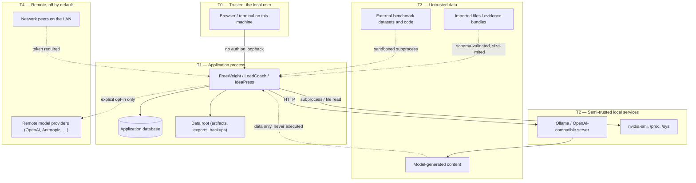

# Security Standards

**Posture:** local-first. The default installation binds to loopback, requires no credentials,
sends nothing off the machine, and keeps every byte of user content local.
Everything that changes any of those facts is explicit, documented and visible in the UI.

---

## 1. Trust boundaries



| Boundary | Crossing | Control |
|---|---|---|
| T0 → T1 | Local user requests | No auth on loopback; `Host` allowlist on every request; double-submit CSRF token on HTML form posts ([ADR-0026](../adr/0026-local-http-hardening.md)) |
| T4(NET) → T1 | LAN requests | Bearer token mandatory; startup refuses non-loopback bind without tokens |
| T1 → T2 | Provider and sensor calls | Timeouts, size caps, output parsed defensively, no shell |
| T3 → T1 | Model output, imports, datasets | Treated as hostile data: never executed, never a path, never unescaped |
| T1 → T4(REM) | Remote inference | Off by default; requires `allow_remote_providers = true` plus a provider entry; every call site labelled as egress in the UI |
| T1 → T4(NET) | An outbound fetch whose URL came from a request body (`POST /evidence/import`) | Scheme, host-allowlist (loopback only by default), literal-IP, redirect and size checks ([ADR-0026 §3](../adr/0026-local-http-hardening.md)) |

---

## 2. Network exposure

* **Default bind: `127.0.0.1`.** Every application, every mode, every install.
* Binding to any other address requires: an explicit `server.host` setting **and** at least one
  configured API token. If either is missing, startup fails with `INSECURE_BINDING` and exit code 3.
* Setting `server.host = "0.0.0.0"` additionally requires `server.allow_lan_exposure = true` as an
  acknowledgement flag — a typo in a host string must not expose a service.
* TLS is terminated by a reverse proxy; the applications speak HTTP. When a non-loopback bind is
  configured, startup logs a WARNING naming the reverse-proxy requirement, and the UI shows a
  persistent notice if `X-Forwarded-Proto` is absent.
* CORS off by default. Enabling requires an explicit origin list; wildcard origins are rejected
  whenever authentication is enabled, and enabling CORS additionally makes bearer tokens mandatory
  (§3.1 explains why).
* **`Host` header allowlist on every request, checked before routing and before authentication.**
  Loopback bind: `localhost`, `127.0.0.1`, `[::1]` and the bound address. Any other bind:
  `server.allowed_hosts`, which becomes a required setting alongside the token and the exposure
  acknowledgement. A mismatch is **421 Misdirected Request**, logged at WARNING with the presented
  value.

  This is not decoration. A loopback bind with no credentials is reachable from any web page the user
  visits, through DNS rebinding: the page resolves an attacker-controlled hostname to `127.0.0.1` and
  the browser's origin check passes because the origin *is* the attacker's hostname. The `Host` header
  is the one thing the attack must present and cannot forge. See
  [ADR-0026 §1](../adr/0026-local-http-hardening.md).

### 2.1 CSRF

* **HTML form routes** carry a double-submit token: a `__Host-`-prefixed `SameSite=Strict` cookie plus
  a hidden field, compared with `hmac.compare_digest`. Mismatch or absence ⇒ 403 `CSRF_FAILED`.
* **The JSON API is exempt, on stated grounds**: it accepts only `application/json` (415 otherwise),
  which a cross-origin form cannot produce, and which forces a CORS preflight that fails while CORS is
  disabled. The exemption is withdrawn — and bearer tokens become mandatory, enforced at startup — if
  CORS is ever enabled.
* The interactive API docs (`/api/v1/docs`) are served only on a loopback bind unless explicitly
  enabled.

---

## 3. Authentication and authorization

See [ADR-0014](../adr/0014-authentication-strategy.md).

* Scheme: `Authorization: Bearer <token>`.
* Token generation: 32 bytes from `secrets.token_bytes`, base32-encoded, prefixed with the app
  (`lc_…`) for identifiability in logs and leak scanners.
* **Storage: SHA-256 hash only.** The plaintext is displayed once at creation and never again, never
  logged, and never written to the database. Comparison uses `hmac.compare_digest`.
  (A slow KDF is unnecessary for a 256-bit random secret and is documented as such in the ADR.)
* Token records carry: name, scope (`read` | `write` | `admin`), created_at, last_used_at, expires_at
  (optional), revoked_at.
* Authorization is scope-based and checked in the service layer, not only at the route.
* Failed authentication is rate-limited per source address (default 10 attempts / minute) and logged
  with the request ID and source, never the presented token.
* CLI commands that manage tokens (`<app> token create|list|revoke`) print the secret exactly once
  to stdout and refuse to run when stdout is not a TTY unless `--force` is given.

---

## 4. Input validation

* Every external input — HTTP body, query string, header, CLI argument, config file, imported file,
  provider response — is validated before use. Pydantic models at the HTTP edge; typed parsers
  elsewhere.
* Requests reject unknown fields (`extra="forbid"`), so typos fail loudly.
* Numeric bounds are declared, not assumed (`temperature: float = Field(ge=0, le=2)`).
* Identifiers used in paths or filenames match a strict allowlist pattern
  (`^[A-Za-z0-9][A-Za-z0-9._-]{0,127}$`) and are validated before any filesystem call.
* Body size limits per [API Standards §10](api-and-contract-standards.md); enforced by middleware
  before the body is buffered.
* Provider responses are parsed defensively: unknown fields ignored, missing fields become
  `UNSUPPORTED`, malformed bodies raise a typed `PROVIDER_PROTOCOL_ERROR` with the raw body stored
  as an artifact for diagnosis (never echoed into the API response).

---

## 5. Filesystem safety

* Every write goes through:

```python
def contained_path(root: Path, *parts: str) -> Path:
    """Join and prove the result stays inside ``root`` after full resolution."""
```

  which resolves symlinks and raises when the result escapes. This is the only sanctioned way to
  build a path from any input that is not a literal.
* Applications write only inside their data root, their config file, and paths the user supplied
  explicitly on the command line.
* Temporary files: `tempfile.mkstemp`/`TemporaryDirectory` with mode `0600`/`0700`, inside the data
  root where possible, always cleaned up in a `finally`.
* New files are `0600`; new directories `0700`. Startup warns when the data root is group- or
  world-writable.
* Uploads are written to a temporary file first, validated (size, type, schema), then moved into
  place atomically. The original filename is never used as the stored name.
* **Archive extraction** (external benchmark datasets, imported bundles) enforces: no absolute
  paths, no `..` components, no symlinks or hardlinks, no device files, per-entry and total size
  caps, entry-count cap, and a decompression-ratio cap (zip-bomb guard). Extraction happens into a
  fresh temporary directory and is validated before anything is moved.

---

## 6. Model-generated content

Treated as untrusted data at all times.

* **Never executed.** No `eval`, no `exec`, no dynamic import, no `subprocess`, no SQL, no shell —
  regardless of how the content is framed.
* **Never used to build a path**, a URL, a hostname, a table name, or a command argument without
  passing the same allowlist validation as any other external input.
* Rendered escaped by default: Jinja2 autoescaping on; Markdown rendered through a sanitizer with an
  allowlist of tags and attributes; no raw HTML from model output ever reaches a template.
* Structured output is validated against its JSON Schema before use. A schema failure is an error or
  a retry, never a partial-parse rescue.
* **Tool calls** requested by a model are executed only when: the tool is on the caller's explicit
  allowlist for that request, the arguments validate against the tool's schema, and the tool itself
  is a bounded, side-effect-audited implementation. Filesystem tools operate on read-only fixtures
  or a dedicated sandbox directory. There is no `shell`, no `delete`, no arbitrary `http` tool.
* Prompt-injection posture: because models never gain execution or path authority, an injected
  instruction can at worst produce bad content — which the validation gates then reject.

---

## 7. Code execution and sandboxing

Benchmarks that execute generated code (EvalPlus, CRUXEval, SWE-bench) and any future
code-execution feature obey a tiered policy ([ADR-0018](../adr/0018-external-benchmark-isolation.md)):

| Tier | Requirement | Status on the reference machine |
|---|---|---|
| 1 | Container (`podman` preferred, then `docker`): no network, read-only rootfs, tmpfs workdir, CPU/memory/pids limits, wall-clock timeout, non-root user, dropped capabilities | Not installed |
| 2 | `bubblewrap` (`bwrap`): unshare net/pid/ipc/uts, read-only bind of the minimal runtime, private tmp, no new privileges, rlimits + timeout | Available |
| 3 | **Refuse** | — |

* There is no host-execution tier. If tiers 1 and 2 are unavailable, the benchmark is **skipped**
  with `sandbox_unavailable` recorded on the run. A test asserts this refusal.
* The chosen tier is recorded on every result that used it; results from different tiers are
  comparable for correctness but labelled for performance.
* Sandboxes never receive credentials, the user's home directory, the application database, or
  network access.

---

## 8. Secrets

* Secrets are **never** committed. `.gitignore` covers `.env`, `*.key`, `*.pem`, `secrets.toml`,
  and every application's data root; `gitleaks` runs in CI on every push and blocks on a finding.
  (A prior project committed `.env` — this is not a hypothetical rule.)
* Sources, in precedence order: environment variable → a file referenced by a `*_file` setting
  (read at startup, mode-checked) → OS keyring where available. Never the config file itself for a
  live secret; the config file may only name where the secret comes from.
* Secrets are redacted everywhere: log formatter redaction filter, error `details`, exception
  messages, config dumps (`<app> config show` prints `********`), exports, telemetry, and API
  responses.
* Any value whose key matches `(?i)(token|key|secret|password|authorization|cookie)` is redacted by
  the logging filter regardless of where it came from.

---

## 9. Data egress and privacy

* The suite makes **no outbound network connections** other than to configured model providers. No
  telemetry, no analytics, no update checks, no CDN, no font fetch, no error reporting.
* All web assets are vendored locally; the UI functions with the machine offline.
* Remote providers require `providers.allow_remote = true` plus an explicit provider entry with an
  explicit API key source. The UI and CLI mark such providers with an egress badge, and the model
  picker shows "content leaves this machine" next to them.
* Exported files contain what the user asked for. Prompt and response content is included only when
  the export explicitly requests it, and the export dialog/flag states that clearly.
* No user content is written to logs at INFO or above. Full-content logging is opt-in
  (`logging.include_content = true`), off by default, and warns at startup when enabled.

---

## 10. Database safety

* Parameterized queries only (SQLAlchemy expression language or bound parameters). String-built SQL
  is banned outside migration DDL.
* Destructive operations (`delete results`, `purge model`, `vacuum`, `reset`) require: a preview of
  exactly what will be removed, an explicit confirmation (`--yes` in CLI, typed confirmation in UI),
  a transaction, and an automatic backup when the affected row count exceeds a configured threshold.
* Migrations take an automatic backup first and restore it on failure.
* Backups are written inside the data root with `0600` and are never uploaded anywhere.
* PostgreSQL deployments: the application's role holds only the privileges it needs (DML plus DDL on
  its own schema); the connection string comes from an environment variable, never the config file.

---

## 11. Dependencies

* `pip-audit` on every CI run, blocking on known-vulnerable versions.
* Dependencies are pinned by compatible range in `pyproject.toml` and locked exactly for CI and
  releases (`requirements/*.lock` produced by `pip-compile` or `uv pip compile`).
* A new runtime dependency requires justification in the pull request: what it does, what the
  alternative was, and its maintenance status. The suite's dependency budget is small on purpose.
* Vendored assets (charting library, fonts, icons) record their version, licence and SHA-256, and
  are re-verified by a test.
* Release artifacts are built in CI from a tag and published with Trusted Publishing (OIDC), never
  with a long-lived API token.

---

## 12. Logging and error disclosure

* No secrets, no full prompts or responses, no absolute paths outside the data root, no stack traces
  in HTTP responses.
* Internal errors return `INTERNAL_ERROR` with the request ID; the detail is in the server log,
  correlated by that ID.
* Authentication failures do not distinguish "no such token" from "wrong token".
* Log files are `0600`, rotated with a size and retention cap, and never written outside the state
  directory.

---

## 13. Threat model summary

| Threat | Likelihood | Mitigation |
|---|---|---|
| Local malware reads the SQLite DB | Low | OS file permissions; no additional protection claimed. Documented honestly — full-disk encryption is the user's responsibility |
| Service accidentally exposed to a hostile LAN | Medium | Loopback default; bind + token + acknowledgement flag required; startup refusal; rate limiting |
| Malicious model output attempts execution | Medium | Content never executed, never a path, never SQL; tools allowlisted and schema-validated; output escaped |
| Malicious benchmark dataset or imported bundle | Medium | Schema validation, size and ratio caps, archive hardening, extraction into a temporary directory, hash pinning |
| Generated code escapes the sandbox | Low–Medium | Tiered sandbox with network off, read-only root, rlimits and timeouts; refusal when unavailable |
| Secret leaks into the repository | Medium | gitleaks in CI, ignore rules, secrets only from env/keyring, redaction filter |
| Vulnerable dependency | Medium | pip-audit blocking, small dependency budget, lockfiles |
| Destructive operation run by accident | Medium | Preview, confirmation, transaction, automatic backup |
| Data leaves the machine unnoticed | Low | No outbound calls by default; remote providers opt-in and badged; egress named in the UI |
| Supply-chain compromise of a published package | Low | Trusted Publishing, tag-triggered builds, no manual uploads, signed provenance where available |

---

## 14. Security testing

Required in every repository (see [Testing Standards](testing-standards.md) §2):

* Path traversal rejected for every path-accepting endpoint and CLI argument.
* Oversize body and oversize upload rejected before buffering.
* Non-loopback bind without a token refuses to start.
* Authenticated endpoints reject missing, malformed, revoked and wrong-scope tokens.
* Token comparison is constant-time; the stored value is a hash, asserted by inspecting the row.
* Log output contains no secret for a request that carried one.
* Archive bomb, absolute-path entry, `..` entry, and symlink entry all rejected.
* Sandbox unavailable ⇒ code-execution benchmark **skipped**, not executed.
* Model output containing `{{ }}`, `<script>`, `../../etc/passwd`, and SQL metacharacters is stored
  and rendered without effect.
* A request with an unexpected `Host` header is refused with 421, on both a loopback and a
  non-loopback bind, and the refusal happens before authentication.
* A non-loopback bind without `server.allowed_hosts` refuses to start, like the missing-token case.
* A forged HTML form post is rejected with `CSRF_FAILED`; a valid one succeeds; a cross-origin JSON
  post is rejected.
* `POST /evidence/import` refuses a `file://` URL, a host outside `evidence.allowed_source_hosts`, a
  literal link-local address, a redirect that changes host, and a response exceeding the import cap —
  each with a distinct reason, and none of them after any bytes have been parsed.
* `GET /api/v1/version` answers without a credential while `/api/v1/health` does not.
* No credential configured for an evidence source is ever sent to a host other than that source.
